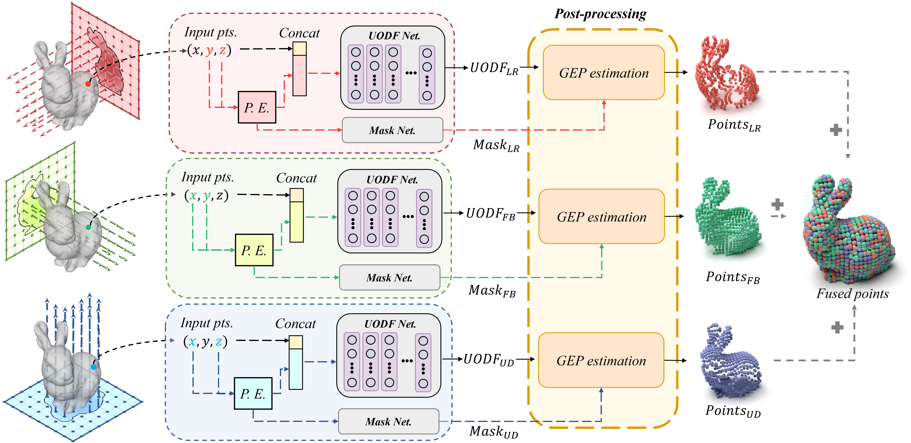

# Unsigned Orthogonal Distance Fields (UODFs)

This repository is the official implementation of the paper (accepted by CVPR 2024): 

**Unsigned Orthogonal Distance Fields: An Accurate Neural Implicit Representation for Diverse 3D Shapes.**

**Authors:** Yujie Lu, Long Wan, Nayu Ding, Yulong Wang, Shuhan Shen, Shen Cai*, Lin Gao*.

**Description in one sentence**. Different from SDF and UDF, each point in UODFs defines the distances along the three orthogonal directions (LR, FB, UD in the figure) and directly infers the nearest surface points (simulating the characteristics of the laser), avoiding the introduction of interpolation errors and improving the reconstruction accuracy.




[Project Page] [Paper](https://arxiv.org/abs/2403.01414) [Video] (Coming soon)


## Visualization

| Dragon | Sliced fish in box | T-shirt |
| :----: | :----: | :----: |
|  |  |  |


## Installation:Setup the environment
### Create environment
```
conda create --name uodf python=3.8
conda activate uodf
pip install --upgrade pip
```
### Dependencies
Insatll Pytorch with CUDA(this repo has been tested with CUDA 11.3).
For CUDA 11.3:
```
pip install torch==1.12.0+cu113 torchvision==0.13.0+cu113 torchaudio==0.12.0 --extra-index-url https://download.pytorch.org/whl/cu113
```

### Setup

Python 3 dependencies:
- pyngpmesh
- trimesh
- h5py
- pymeshlab
- scipy
- tqdm
- matplotlib
- pandas
- tensorboard

To install the dependencies, begin by navigating to the third_party directory and proceed to install pyngpmesh, which is a library separated from instant-ngp.
```
cd third_party/ngpmesh
pip install .
cd ../../
```
then
```
pip install -r requirements.txt
```

### DataSet
You can use the example dataset in  `datasets/thingi32_normalization/` or you can put your custom datasets in `datasets/` directory.


## Configrations
All configurable settings are accessible within the `scripts/utils/options.py`

## Run
To train a single model, you can use it.
```
python scripts/train_main.py
```
or if you need to test, you can use the following command.
```
python scripts/test_main.py
```
To generate fused point clouds and mesh, you can utilze the following:
```
python scripts/PostProccessing.py
```


## Evaluation
```
python scripts/eval_cd.py
```

## Citation

```bibtex
@inproceedings{UODFs,
  title={Unsigned Orthogonal Distance Fields: An Accurate Neural Implicit Representation for Diverse 3D Shapes},
  author={Lu, Yujie and Wan, Long and Ding, Nayu and Wang, Yulong and Shen, Shuhan and Cai, Shen and Gao, Lin},
  booktitle={IEEE/CVF Conference on Computer Vision and Pattern Recognition (CVPR)},
  year={2024}
}
```


