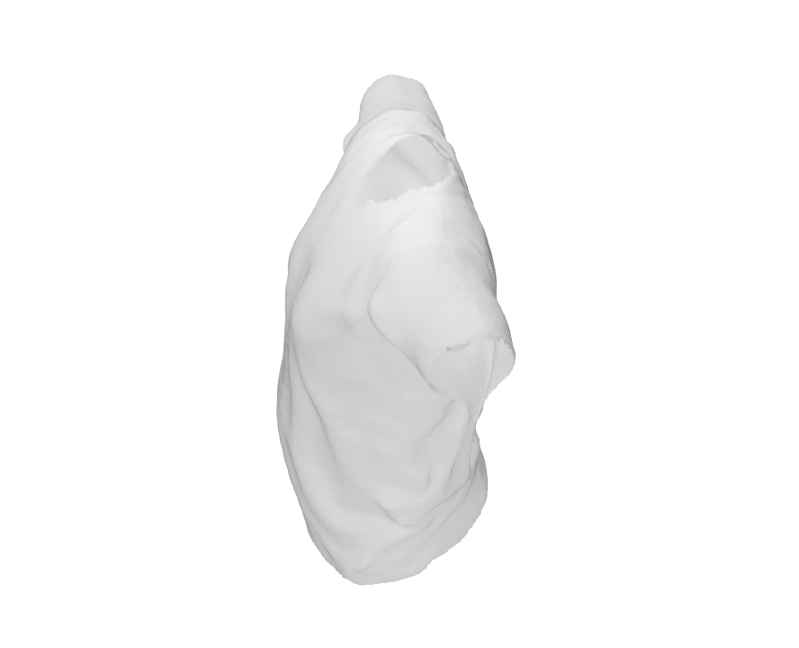

# Unsigned Orthogonal Distance Fields (UODFs)

This repository is the official implementation of the paper (accepted by CVPR 2024): 

**Unsigned Orthogonal Distance Fields: An Accurate Neural Implicit Representation for Diverse 3D Shapes**。 

**Abstract**. Neural implicit representation of geometric shapes has witnessed considerable advancements in recent years. However, common distance field based implicit representations, specifically signed distance field (SDF) for watertight shapes or unsigned distance field (UDF) for arbitrary shapes, routinely suffer from degradation of reconstruction accuracy when converting to explicit surface points and meshes. In this paper, we introduce a novel neural implicit representation based on unsigned orthogonal distance fields (UODFs). In UODFs, the minimal unsigned distance from any spatial point to the shape surface is defined solely in one orthogonal direction, contrasting with the multi-directional determination made by SDF and UDF. Consequently, every point in the 3D UODFs can directly access its closest surface points along three orthogonal directions. This distinctive feature leverages the accurate reconstruction of surface points without interpolation errors. We verify the effectiveness of UODFs through a range of reconstruction examples, extending from simple watertight or non-watertight shapes to complex shapes that include hollows, internal or assembling structures.


[Project Page] [Paper](https://arxiv.org/abs/2403.01414) [Video] (Coming soon)


## Visualization

| Dragon | Shark | T-shirt |
| :----: | :----: | :----: |
|  |  |  |


## Installation:Setup the environment
### Create environment
```
conda create --name uodf python=3.8
conda activate uodf
pip install --upgrade pip
```
### Dependencies
Insatll Pytorch with CUDA(this repo has been tested with CUDA 11.3).
For CUDA 11.3:
```
pip install torch==1.12.0+cu113 torchvision==0.13.0+cu113 torchaudio==0.12.0 --extra-index-url https://download.pytorch.org/whl/cu113
```

### Setup

Python 3 dependencies:
- pyngpmesh
- trimesh
- h5py
- pymeshlab
- scipy
- tqdm
- matplotlib
- pandas
- tensorboard

To install the dependencies,first go to third_party to install pyngpmesh.(Libraries separated from instant-ngp)
```
cd third_party/ngpmesh
pip install .
cd ../../
```
then
```
pip install -r requirements.txt
```

### DataSet
You can use the example dataset in  `datasets/thingi32_normalization/` or you can put your custom datasets in `datasets/` directory.


## Configrations
All configurable settings are accessible within the `scripts/utils/options.py`

## Run
To train a single model,you can use it.
```
python scripts/train_main.py
```
or if you need to test,you can use the following command.
```
python scripts/test_main.py
```
To generate fused point clouds and mesh, you can utilzed the following:
```
python scripts/PostProccessing.py
```


## Eval
```
python scripts/eval_cd.py
```

## Citation

```bibtex
@inproceedings{UODFs,
  title={Unsigned Orthogonal Distance Fields: An Accurate Neural Implicit Representation for Diverse 3D Shapes},
  author={Lu, Yujie and Wan, Long and Ding, Nayu and Wang, Yulong and Shen, Shuhan and Cai, Shen and Gao, Lin},
  booktitle={Computer Vision and Pattern Recognition (CVPR)},
  year={2024}
}
```


